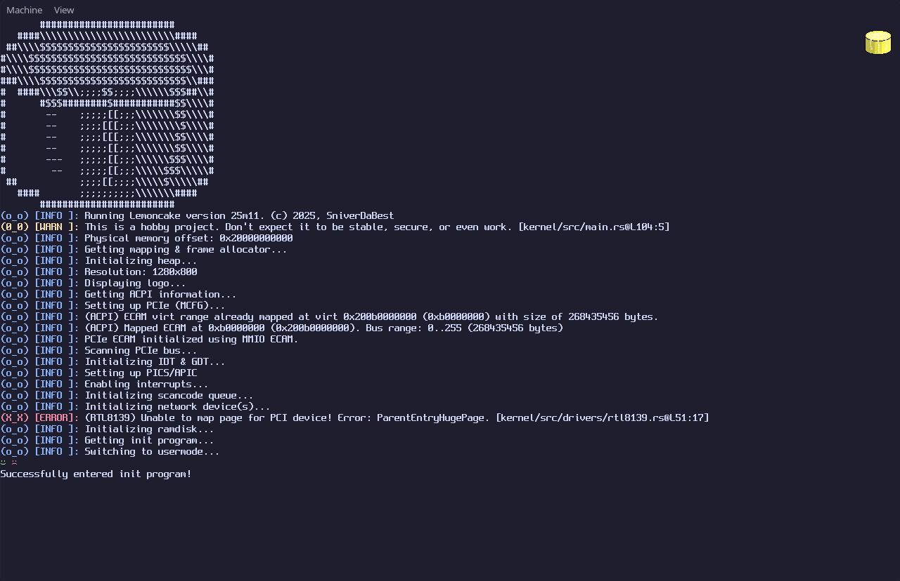

# Info
Lemoncake is a small OS, that was originally called `lemonade`. However, I have come to dislike that name, and dislike the rest of the codebase. So, it's been scrapped, and it's renamed.\
\
It's written in Rust, with a chance some code in other languages may be written eventually..\
\
Here's a picture of it running:

>[!TIP]
> If you're having issues, try running the utility script.\
> You can do so with the following command: `python utils.py`\
> The script creates the hard disk image, and uses `rustup` to install some components and target info.

# Dependencies
To build, you can run `cargo build` in the root project directory.\
\
The only dependencies you'll need are:
- Cargo
- Qemu
- Python
- mkfs.fat (dosfstools, i think?)
<!-- END OF LIST><!-->

# Running it yourself
>[!CAUTION]
> It isn't recommended to run this on your host PC, as it could possibly break something that you need, wipe a drive, etc.

You can check it out in Qemu, by just running `cargo run` in the root project directory.\
If you want, you could also use VirtualBox, VMWare, or maybe something else to emulate it, but it won't happen with `cargo run`, you'd need to manually do that yourself.

>[!TIP]
> If you're having issues with running QEMU, try removing the acceleration flag in `src/main.rs`.

# Contributions
Contributions would by highly appreciated!

# License
Lemoncake uses the NON-AI BSD 2-clause (simplified) license. Check `LICENSE` for the full license.

# Credits
Lemoncake uses quite a few dependencies. Most are under MIT, some are a dual license with either MIT or Apache 2.0.\
\
However, there are some things that I would like to credit that weren't libraries.
* Spleen - fcambus/spleen on GitHub
    * The font used in the TTY.
    * Under MIT License.
* Fomos' APIC code - Ruddle/Fomos on GitHub
    * A lot of code for the APIC is borrowed from here.
    * Under BSD 2-Clause (Simplified) License.
